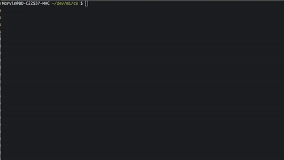

# Magento Codeception

Magento Codeception is a template for testing a magento shop with codeception and selenium.
This template includes the magento installation with sample data and one test for testing the checkout process.  



## Setup basic magento shop

To run this project you have to install `docker` and `docker-compose`.

```sh
docker-compose down -v && \
rm -rf app/web/ app/vendor/ && \
docker run --rm -it -v $(pwd)/app:/app mc388/composer update --ignore-platform-reqs && \
docker-compose up -d && \
cp -R magento-sample-data-1.9.2.4/media/* app/web/media/ && \
cp -R magento-sample-data-1.9.2.4/skin/* app/web/skin/ && \
docker exec -i magento_mysql_1 mysql -uroot -ppw magento < magento-sample-data-1.9.2.4/magento_sample_data_for_1.9.2.4.sql && \
cp local.xml app/web/app/etc/local.xml && \
cp Zz_DisableModules.xml app/web/app/etc/modules/Zz_DisableModules.xml && \
docker exec -i magento_mysql_1 mysql -uroot -ppw magento < DisableModules.sql && \
docker-compose exec php magerun cache:cl
```

## Domain

Create a hosts file entry to `dev.local` and test the shop frontend.

## Run codeception acceptance tests

```sh
docker-compose run --rm codecept run acceptance CheckoutCest
```

### Options

- If you change you hosts domain, you also have to change the domain in the `docker-compose.yml` and `app/tests/acceptance.suite.yml` file.
- Screenshots for failed tests are stored in `app/test/_output`.
